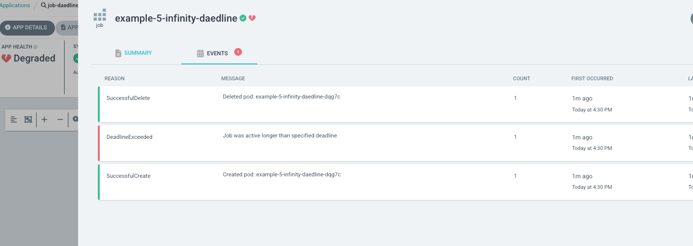

# 개요
* ArgoCD에서 쿠버네티스 job사용

# 목차
* [replaced options jo](./replaced.yaml)
* [daedline job](./deadline-job.yaml) : ArgoCD status가 Degraded가 됨

# 참고자료
* https://www.infracloud.io/blogs/deploy-manage-kubernetes-jobs-using-argocd/
